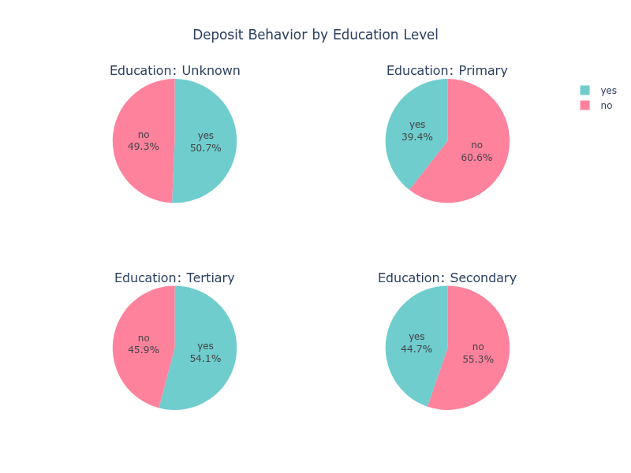
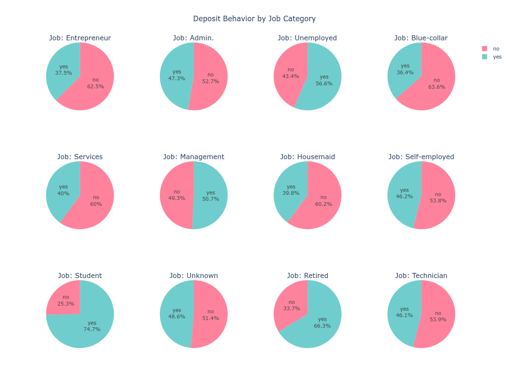
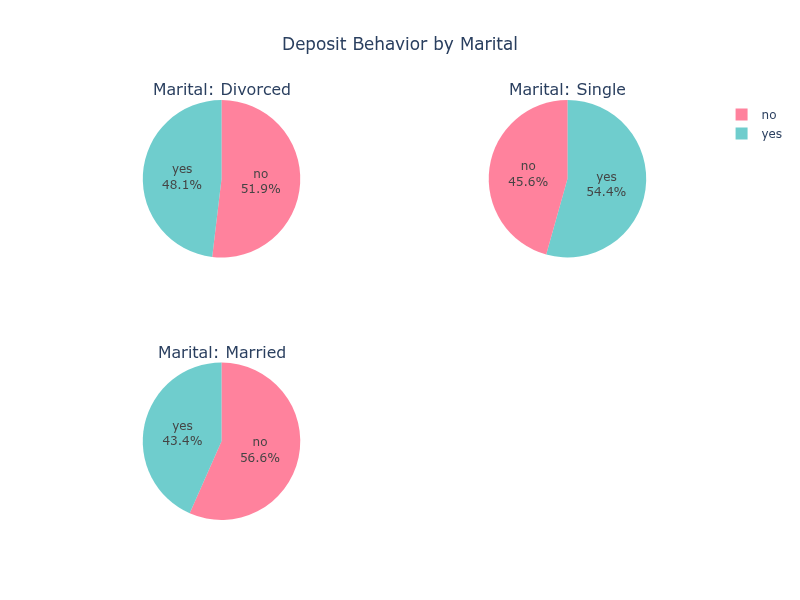
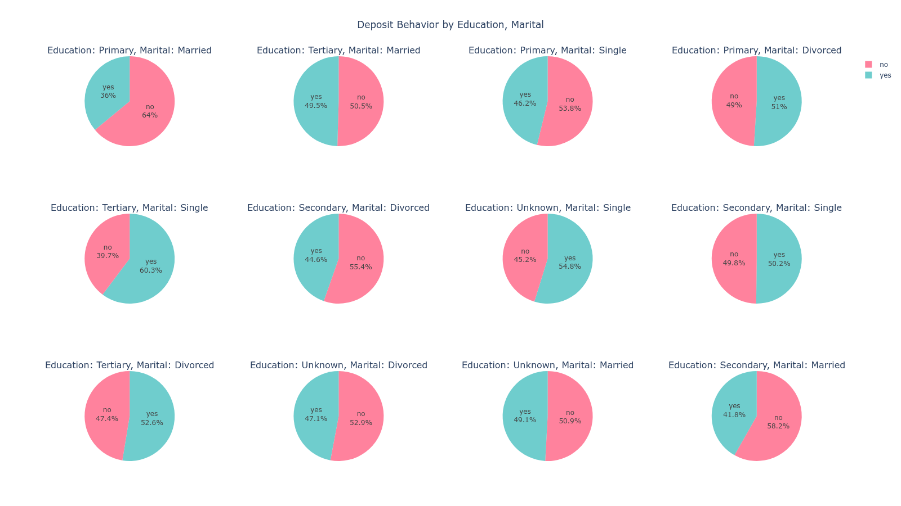

# Relative Frequency

Khi có dữ liệu dạng danh mục (category), chúng ta có thể  dùng frequency để xác định phân bố của dữ liệu theo từng danh mục.

# Xét số liệu deposit theo học vấn


Cách gọi như sau (Giả sử dev đã quen thuộc với các jobs)

```json
jobs = [
  {
    "task": "loading",
    "action": "load_dataframe",
    "kwargs": {
      "input_arrow": "/path/logistic.arrow"
    }
  },
  {
    "task": "transforming",
    "action": "frequency_by",
    "kwargs": {
      "column": "deposit",
      "by": "education"
    }
  }
]
```

Giải thích tham số:
- *column*: String; tên cột để xác định frequency.
- *by*: Tên cột để phân nhóm.

Kết quả output:

| education | deposit_val | deposit_freq | deposit_rel_freq |
| --- | --- | --- | --- |
| primary | yes | 591 | 39.40 |
| primary | no | 909 | 60.60 |
| tertiary | yes | 1996 | 54.11 |
| tertiary | no | 1693 | 45.89 |
| unknown | yes | 252 | 50.70 |
| unknown | no | 245 | 49.30 |
| secondary | yes | 2450 | 44.74 |
| secondary | no | 3026 | 55.26 |

Giải thích kết quả:

- Cột education: Gồm các giá trị khác nhau theo phân nhóm của `education`.
- `deposit_val`: Chứa các giá trị khác nhau của biến `deposit`.
- `deposit_freq` là frequency và `deposit_rel_freq` là tỉ lệ phần trăm


Với kết quả của bản đưa ra, chúng ta có thể  vẽ thành đồ thị biểu diễn:




Mỗi biểu đồ tròn thể hiện tỷ lệ yes so với no deposits, dựa trên deposit_rel_freq. Ví dụ:

unknown: 50,70% yes, 49,30% no.

primary: 39,40% yes, 60,60% no.

tertiary: 54,11% yes, 45,89% no.

secondary: 44,74% yes, 55,26% no.

Khi di chuột vào một phần biểu đồ, hiển thị phần trăm và số lượng (ví dụ: “yes: 50,70% (Count: 252)” đối với unknown).


Phân tích insights:

- Tertiary Education: Tỷ lệ yes cao nhất (54,11%), cho thấy xu hướng gửi tiền mạnh hơn.

- Primary Education: Tỷ lệ no cao nhất (60,60%), cho thấy ít khả năng gửi tiền hơn.

- Unknown Education: Gần như cân bằng giữa yes (50,70%) và no (49,30%).

- Secondary Education: Nghiêng về no ở mức vừa phải (55,26% so với 44,74%).


# Xét số liệu deposit theo ngành nghề


```json
jobs = [
        {
            "task": "loading",
            "action": "load_dataframe",
            "kwargs": {"input_arrow": input_arrow},
        },
        {
            "task": "transforming",
            "action": "frequency_by",
            "kwargs": {"column": "deposit", "by": "job"},
        },
    ]
```


Kết quả output như sau:

| job | deposit_val | deposit_freq | deposit_rel_freq |
| --- | --- | --- | --- |
| entrepreneur | yes | 123 | 37.50 |
| entrepreneur | no | 205 | 62.50 |
| admin. | yes | 631 | 47.30 |
| admin. | no | 703 | 52.70 |
| unemployed | yes | 202 | 56.58 |
| unemployed | no | 155 | 43.42 |
| blue-collar | yes | 708 | 36.42 |
| blue-collar | no | 1236 | 63.58 |
| services | yes | 369 | 39.98 |
| services | no | 554 | 60.02 |
| management | yes | 1301 | 50.70 |
| management | no | 1265 | 49.30 |
| housemaid | yes | 109 | 39.78 |
| housemaid | no | 165 | 60.22 |
| self-employed | yes | 187 | 46.17 |
| self-employed | no | 218 | 53.83 |
| student | yes | 269 | 74.72 |
| student | no | 91 | 25.28 |
| unknown | yes | 34 | 48.57 |
| unknown | no | 36 | 51.43 |
| retired | yes | 516 | 66.32 |
| retired | no | 262 | 33.68 |
| technician | yes | 840 | 46.08 |
| technician | no | 983 | 53.92 |

Với kết quả này, chúng ta có thể biểu diễn đồ thị




Phân tích insights:

- Tỉ lệ `yes` cao: `student` (74.72%) và `retired` (66.32%) có tỷ lệ `yes` cao nhất, cho thấy xu hướng mạnh mẽ trong việc gửi tiền.

- Tỉ lệ `no` cao: `blue-collar` (63.58%) và `entrepreneur` (62.50%) có tỷ lệ `no` cao nhất.

- Phân bố cân bằng giữa hai khả năng: `management` (50.70% yes, 49.30% no) và `unknown` (48.57% yes, 51.43% no) gần như cân bằng.


# Xét số liệu deposit theo tình trạng hôn nhân


```json
jobs = [
  {
    "task": "loading",
    "action": "load_dataframe",
    "kwargs": {
      "input_arrow": "/path/logistic.arrow"
    }
  },
  {
    "task": "transforming",
    "action": "frequency_by",
    "kwargs": {
      "column": "deposit",
      "by": "marital"
    }
  }
]
```

Kết quả output như sau:


| marital | deposit_val | deposit_freq | deposit_rel_freq |
| --- | --- | --- | --- |
| divorced | yes | 622 | 48.11 |
| divorced | no | 671 | 51.89 |
| married | yes | 2755 | 43.38 |
| married | no | 3596 | 56.62 |
| single | yes | 1912 | 54.35 |
| single | no | 1606 | 45.65 |


Biểu diễn đồ thị




# Xét số liệu deposit theo học vấn và tình trạng hôn nhân


```json
jobs = [
  {
    "task": "loading",
    "action": "load_dataframe",
    "kwargs": {
      "input_arrow": "/path/logistic.arrow"
    }
  },
  {
    "task": "transforming",
    "action": "frequency_by",
    "kwargs": {
      "column": "deposit",
      "by": [
        "education",
        "marital"
      ]
    }
  }
]

```

Kết quả output như sau:

| education | marital | deposit_val | deposit_freq | deposit_rel_freq |
| --- | --- | --- | --- | --- |
| primary | married | yes | 396 | 36.03 |
| primary | married | no | 703 | 63.97 |
| primary | single | yes | 91 | 46.19 |
| primary | single | no | 106 | 53.81 |
| tertiary | married | yes | 913 | 49.54 |
| tertiary | married | no | 930 | 50.46 |
| unknown | married | yes | 142 | 49.13 |
| unknown | married | no | 147 | 50.87 |
| unknown | single | yes | 86 | 54.78 |
| unknown | single | no | 71 | 45.22 |
| primary | divorced | yes | 104 | 50.98 |
| primary | divorced | no | 100 | 49.02 |
| tertiary | divorced | yes | 203 | 52.59 |
| tertiary | divorced | no | 183 | 47.41 |
| secondary | single | yes | 855 | 50.18 |
| secondary | single | no | 849 | 49.82 |
| unknown | divorced | yes | 24 | 47.06 |
| unknown | divorced | no | 27 | 52.94 |
| secondary | divorced | yes | 291 | 44.63 |
| secondary | divorced | no | 361 | 55.37 |
| secondary | married | yes | 1304 | 41.79 |
| secondary | married | no | 1816 | 58.21 |
| tertiary | single | yes | 880 | 60.27 |
| tertiary | single | no | 580 | 39.73 |


Biểu diễn đồ thị




