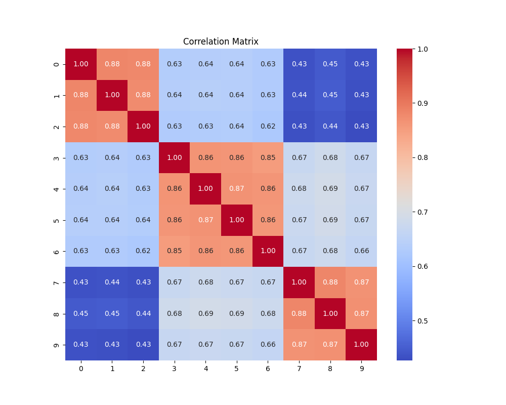

# Factor Analysis Service

This tutorial is to replicate the research by

| Major Depressive | Dysthymia | GAD | Social Phobia | Simple Phobia | Agoraphobia | Panic | Alcohol Dep | Drug Dep | ASPD | features |
| --- | --- | --- | --- | --- | --- | --- | --- | --- | --- | --- |
| 1.00 | 0.88 | 0.88 | 0.63 | 0.64 | 0.64 | 0.63 | 0.43 | 0.45 | 0.43 | Major Depressive |
| 0.88 | 1.00 | 0.88 | 0.64 | 0.64 | 0.64 | 0.63 | 0.44 | 0.45 | 0.43 | Dysthymia |
| 0.88 | 0.88 | 1.00 | 0.63 | 0.63 | 0.64 | 0.62 | 0.43 | 0.44 | 0.43 | GAD |
| 0.63 | 0.64 | 0.63 | 1.00 | 0.86 | 0.86 | 0.85 | 0.67 | 0.68 | 0.67 | Social Phobia |
| 0.64 | 0.64 | 0.63 | 0.86 | 1.00 | 0.87 | 0.86 | 0.68 | 0.69 | 0.67 | Simple Phobia |
| 0.64 | 0.64 | 0.64 | 0.86 | 0.87 | 1.00 | 0.86 | 0.67 | 0.69 | 0.67 | Agoraphobia |
| 0.63 | 0.63 | 0.62 | 0.85 | 0.86 | 0.86 | 1.00 | 0.67 | 0.68 | 0.66 | Panic |
| 0.43 | 0.44 | 0.43 | 0.67 | 0.68 | 0.67 | 0.67 | 1.00 | 0.88 | 0.87 | Alcohol Dep |
| 0.45 | 0.45 | 0.44 | 0.68 | 0.69 | 0.69 | 0.68 | 0.88 | 1.00 | 0.87 | Drug Dep |
| 0.43 | 0.43 | 0.43 | 0.67 | 0.67 | 0.67 | 0.66 | 0.87 | 0.87 | 1.00 | ASPD |

